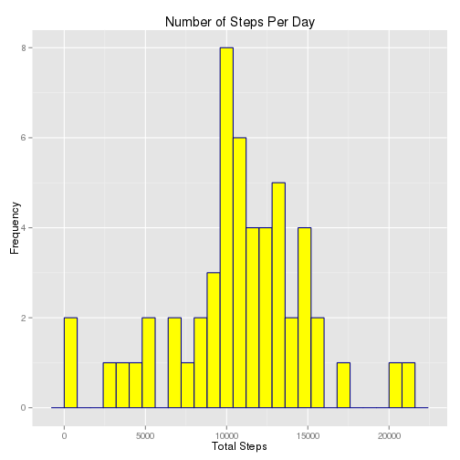
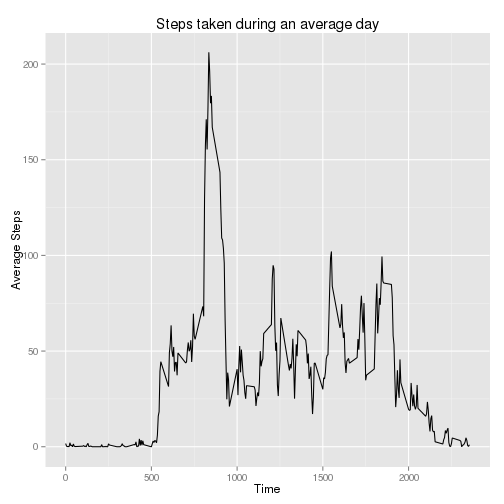
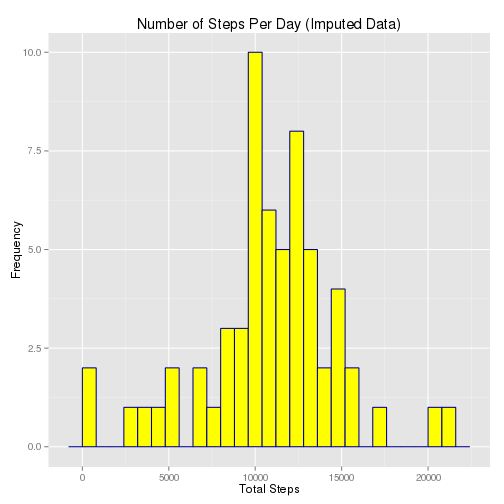
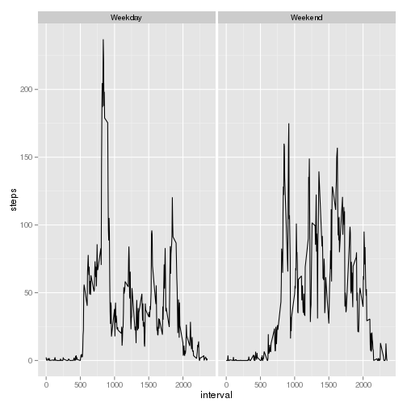

# Reproducible Research: Peer Assessment 1
In this assignment we will analyze personal activity data collected from activity monitoring devices. The device tracks the number of steps occurring in each five minute interval. We are interested in determining if there are any discernable patterns to the individuals physical activity. Some of the questions we will attempt to answer are: 
 1. How many steps are taken in an average day?
 2. When are the the individuals most active?
 3. What is the breakdown of steps in an average day?
 4. Are activity levels different on weekends compared to weekdays?

## Loading and preprocessing the data
The data for this analysis is available from "Roger's GitHub", the following code assumes the repository has been cloned onto the working machine. The first step in any analysis is getting a feel for how the data is structured. From there we can determine if any changes need to be made.

```r
if (!"activity.csv" %in% dir()) unzip("activity.zip")
activity <- read.csv("activity.csv")
str(activity)
```

```
## 'data.frame':	17568 obs. of  3 variables:
##  $ steps   : int  NA NA NA NA NA NA NA NA NA NA ...
##  $ date    : Factor w/ 61 levels "2012-10-01","2012-10-02",..: 1 1 1 1 1 1 1 1 1 1 ...
##  $ interval: int  0 5 10 15 20 25 30 35 40 45 ...
```

```r
range(activity$interval)
```

```
## [1]    0 2355
```

```r
sum(is.na(activity$steps))
```

```
## [1] 2304
```

```r
range(activity$steps, na.rm = TRUE)
```

```
## [1]   0 806
```

From this first glance we can determine we may have some potential problems with our current data structure. The date variable is currently a factor variable, but it would make more sense and be more useful if it was in a DateTime format. In addition, the interval variable is actually an integer representation of the time at which the current interval started, this could also be represented more clearly as either a string or a time variable. The dataset itself appears to be missing a significant number of values, 13.1148% to be exact. We will have to delay dealing with the missing values until later. Our next step will be to create a new processed data set. We may not need all the new variables but it will give us more options to choose from in our analysis.

```r
require(stringr)
```

```
## Loading required package: stringr
```

```r
processed <- activity
Time <- str_pad(activity$interval, width = 4, side = "left", pad = "0")
DateTime <- as.POSIXct(paste(activity$date, Time, sep = " "), format = "%Y-%m-%d %H%M")
processed$Time <- Time
processed$DateTime <- DateTime
processed$hourOfDay <- as.factor(as.integer(Time)%/%100)
processed$dayOfWeek <- as.factor(weekdays(DateTime))
```

Now that our data is in a more useful form we can go ahead and attempt to answer some of the questions posed earlier.

## What is mean total number of steps taken per day?
Our first question is also our simplest: What is an average day? In order to answer it however we first need to view our data at a daily scale, instead of our current scale of the interval. 

```r
require(plyr)
```

```
## Loading required package: plyr
```

```r
dailySteps <- ddply(processed, .(date), summarize, stepsByDay = sum(steps))
head(dailySteps)
```

```
##         date stepsByDay
## 1 2012-10-01         NA
## 2 2012-10-02        126
## 3 2012-10-03      11352
## 4 2012-10-04      12116
## 5 2012-10-05      13294
## 6 2012-10-06      15420
```

We can now quite clearly see that the individual, on average, walks 1.0766 &times; 10<sup>4</sup> steps each day. We found the average value, but is this a good measure of the center, the median number of steps in a single day is 10765. These values are quite close and seem to imply the distribution of steps is approximately symmetric. The histogram below shows that there is more variability in daily steps than these two point estimates would suggest. On most days the individual took between 6,000 and 16,000 steps, but there are a few days with values significantly higher or lower than this. At this point it is difficult to determine what might be causing these atypical values.

```r
require(ggplot2)
```

```
## Loading required package: ggplot2
```

```r
ggplot(dailySteps, aes(x = stepsByDay)) + geom_histogram(binwidth = 800, colour = "darkblue", 
    fill = "yellow") + ggtitle("Number of Steps Per Day") + xlab("Total Steps") + 
    ylab("Frequency")
```

 


## What is the average daily activity pattern?  
We have seen what an average day looks like in terms of total number of steps, but this tells us nothing about when an individual is most active. To answer our second question we will need to look within each day and see what the average number of steps is for each five minute time interval.

```r
timeSteps <- ddply(processed, .(interval), summarize, meanSteps = mean(steps, 
    na.rm = TRUE))
```

The number of steps taken in each five minute interval has a rather large range, [0, 206.1698] but if we look more closely 

```r
summary(timeSteps$meanSteps)
```

```
##    Min. 1st Qu.  Median    Mean 3rd Qu.    Max. 
##    0.00    2.49   34.10   37.40   52.80  206.00
```

we see that in 75% of the intervals less than 53 steps were taken, while the first quantile's value of 2.5 steps per five minutes suggest that the individuals in the data set are not far off from the recommended eight hours of sleep per night. The last quantile is the most interesting, the individuals are very active for only a small subset of the day. When is this occurring?
It appears 835 is when our subjects were at their most active. The plot below shows a very clear spike between the the times of 8:10 and 9:25. It then exhibits a more cyclic nature, while maintaining a minimum level of ~25 steps per interval before trailing off during the evening hours. This seems to suggest that the individuals in the study are most active while at work, and in particular during the morning rush into the office. More personal information would be required to verify these conjectures.

```r
ggplot(timeSteps, aes(x = interval, y = meanSteps)) + geom_line() + xlab("Time") + 
    ylab("Average Steps") + ggtitle("Steps taken during an average day")
```

 

## Imputing missing values
So far we have ignored the days with missing measurements, this was done in part to avoid the issue of calculating the total number of steps for a day when half the intervals were missing. It may however be possible to use the data we do have available to attempt to fill in the missing measurements. Before attempting to impute it is important to make sure lack of data is not systematic, or consistent. If the values appear to be missing at random, we should be ably to safely fill them in with the data we have left over.


```r
naIndex <- which(is.na(processed$steps))
length(naIndex)
```

```
## [1] 2304
```

```r
table(processed[naIndex, ]$dayOfWeek)
```

```
## 
##    Friday    Monday  Saturday    Sunday  Thursday   Tuesday Wednesday 
##       576       576       288       288       288         0       288
```

```r
actCount <- count(processed, c("dayOfWeek", "interval"))
table(actCount[, c(1, 3)])
```

```
##            freq
## dayOfWeek     8   9
##   Friday      0 288
##   Monday      0 288
##   Saturday  288   0
##   Sunday    288   0
##   Thursday    0 288
##   Tuesday     0 288
##   Wednesday   0 288
```

```r

processed$isNA <- as.integer(is.na(processed$steps))
naCount <- count(processed, c("dayOfWeek", "interval", "isNA"))
table(naCount[naCount$isNA == 1, c(1, 4)])
```

```
##            freq
## dayOfWeek     1   2
##   Friday      0 288
##   Monday      0 288
##   Saturday  288   0
##   Sunday    288   0
##   Thursday  288   0
##   Tuesday     0   0
##   Wednesday 288   0
```

The tables above show that when a value is missing, it is missing for the entire day. This tells us we are not trying to impute on a time interval for which we have no prior knowledge. In addition, at the worst on Mondays and Fridays, we will be filling in two missing days using data from the seven other days for which we have information. On Thursday and Wednesday we will be imputing one days worth of missing values using data from eight other days. Saturday and Sunday are also missing a single day, but only have eight total measurements, while Tuesday has no missing values whatsoever. The percentage of missing values for the dataset as a whole are 13.1148%, while the the maximum percentage missing for a specific day are 22.2222%.  
The benefits of imputing on this data set are debatable, however the exploratory analysis above showed us that the missing values were potentially random and not systematic in any way. Because of this we will proceed with the imputation. The best option for imputing the values will be to fill in the missing values using both the day of the week and the interval. The bulk of our missing values take place on Friday or Monday. The percent of data points missing per day range from 0% on Tuesday up to 22.2% on Monday and Friday. With 78% remaining we should still have enough to impute safely. The reason for using the time interval as well as the day should be obvious from our earlier plot. 

```r
imputeVals <- ddply(processed, .(dayOfWeek, interval), summarize, meanSteps = mean(steps, 
    na.rm = TRUE))

getImputeVal <- function(day, interval) {
    imputeVals[imputeVals$dayOfWeek == day & imputeVals$interval == interval, 
        "meanSteps"]
}
activityImputed <- processed
for (i in 1:nrow(processed)) {
    if (is.na(processed$steps[i])) {
        activityImputed$steps[i] = getImputeVal(processed$dayOfWeek[i], processed$interval[i])
    }
}
```

Now that we have filled in our missing data points, we can redo our previous analyses and see if we get comparable results for daily steps taken.

```r
dailyStepsImputed <- ddply(activityImputed, .(date), summarize, steps = sum(steps))
ggplot(dailyStepsImputed, aes(x = steps)) + geom_histogram(binwidth = 800, colour = "darkblue", 
    fill = "yellow") + ggtitle("Number of Steps Per Day (Imputed Data)") + xlab("Total Steps") + 
    ylab("Frequency")
```

 

```r
mean(dailyStepsImputed$steps)
```

```
## [1] 10821
```

```r
median(dailyStepsImputed$steps)
```

```
## [1] 11015
```

The histogram is very similar, while the measures of center have both increased slightly. This tells us that more of our missing days of measurement were high activity days, rather than low activity days. We missed measurements for two each of Monday and Friday, while one each of Wednesday, Thursday, Saturday, and Sunday. This means we imputed values for six weekdays compared to only two weekend days. could this have been enough to shift our centrality measurements higher?
## Are there differences in activity patterns between weekdays and weekends?
To answer the question posed above we will add an additional variable weekend.

```r
activityImputed$weekend <- ifelse(activityImputed$dayOfWeek %in% c("Saturday", 
    "Sunday"), "Weekend", "Weekday")
ggplot(activityImputed, aes(x = interval, y = steps)) + stat_summary(fun.y = "mean", 
    geom = "line") + facet_wrap(~weekend)
```

 

The above plot clearly shows that while the number of steps doesn't peak quite as high on the weekend as the weekdays it is consistently higher throughout the bulk of the day. However this does not account for the uptick we saw in the mean values using our imputed data. If we look at the distribution of steps by day of the week however it becomes more clear:

```r
ddply(activityImputed, .(dayOfWeek), summarize, steps = sum(steps))
```

```
##   dayOfWeek  steps
## 1    Friday 111237
## 2    Monday  89774
## 3  Saturday 100283
## 4    Sunday  98222
## 5  Thursday  73915
## 6   Tuesday  80546
## 7 Wednesday 106117
```

We have more missing values for the average to high step days than we do for the low step days. This suggests that our original measure of average steps per day could be biased and the values calculated using our imputed data could be more accurate. 
